# Using Visual Studio with Particle

Starting with Visual Studio 2017 version 15.5 (currently only in Preview), you can use many of the features of Microsoft Visual Studio with Particle firmware. Things like IntelliSense work, as do features like refactoring and all sorts of linking between things in source. 

It's not perfect yet, but it's quite cool. And it works with the free Community edition.

## Installation

### Microsoft Visual Studio Preview

You currently need to download the [Preview Edition](https://www.visualstudio.com/vs/preview/) which is only available for Windows. 

- Select **Linux development with C++** in the left list and also 
- **Embedded and IoT Development** in the Summary on the right.


If you don't need Windows or mobile development, you can save much time and space by not installing those. You can only install Linux development with C++ if you want to.

It's also possible to install both the real version and preview on the same computer.

There's a [Microsoft blog post](https://blogs.msdn.microsoft.com/vcblog/2017/10/23/arm-gcc-cross-compilation-in-visual-studio/) about it if you'd like more information.

Hopefully when released support will be added for the Mac as well. The current Mac release doesn't have support for this.

### Source directory

You'll need pick a directory to hold the your source as well as the system firmware and gcc-arm files. I picked the directory **src** in my Documents directory.

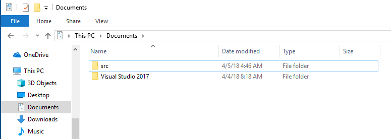

Avoid names with a space or other non-alphanumeric characters in them, as they may cause problems later on.

I recommend you create a separate folder for each project and open only that folder in Visual Studio. For really simple projects with just a source file can have more than one project in a solution. 

You can only have a single library or complex project with a project.properties per solution (open folder), however.

### Download the gcc-arm toolchain

You can't actually do a local compile using this yet, however, you need to download it so IntelliSense has access to all of the header files.

The gcc-arm toolchains are here: [https://launchpad.net/gcc-arm-embedded](https://launchpad.net/gcc-arm-embedded)

Currently, the [5-2016-q1-update](https://launchpad.net/gcc-arm-embedded/5.0/5-2016-q1-update) is recommended.

Prior to system firmware 0.6.3 you can also use the 4.9-2015-q3-update.

The 5.4.x and 6.x versions are not recommended at this time.

- For Windows, download the installer [gcc-arm-none-eabi-5_3-2016q1-20160330-win32.exe](https://launchpad.net/gcc-arm-embedded/5.0/5-2016-q1-update/+download/gcc-arm-none-eabi-5_3-2016q1-20160330-win32.exe).

- Run the installer. Select **Next >** and **I Agree** for the terms and conditions of the license.

- You can use the default install location, or select another. The default location may vary, but on 64-bit Windows is typically:
C:\Program Files (x86)\GNU Tools ARM Embedded\5.3 2016q1

- On the final page, be sure to select **Add path to environment variable** before clicking **Finish**. This is not the default and it is required for the builds to work properly later on for local builds.

;

You must make a copy of the **5.3 2016q1** directory into your **src** directory. This shouldn't be necessary, but I had trouble getting the IntelliSense to recognize the environment variables and this was the easiest workaround.

- Navigate to **C:\Program Files (x86)\GNU Tools ARM Embedded** (1)

- Right click on **5.3 2016q1** and select **Copy** (2).

- Right click in your **src** directory and select **Paste** (3).

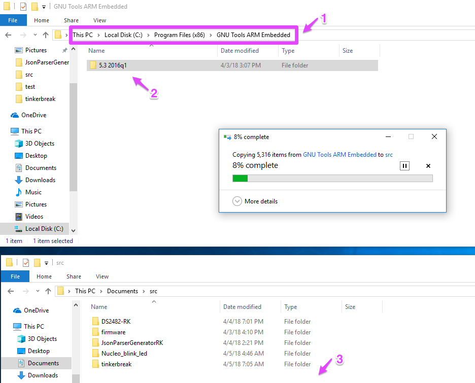

Technically you only need the arm-none-eabi and lib directories, so if you're low on space you can omit the others for now.

- Rename **5.3 2016q1** to **gcc-arm**. That's a hyphen between gcc and arm.

### Install git

This isn't strictly necessary, however it makes life much easier for getting the system firmware source. You could download it from https://github.com manually and unzip it, however.

- Go to [https://git-scm.com/](https://git-scm.com/) and download the latest Windows version for your type of Windows. In my case, I downloaded 2.10.2 for 64-bit Windows.

- Run the installer and select **Next >** to accept the license terms.

- You will typically install in the default location (**C:\Program Files\Git**) and click **Next >**.

- The default components should be fine and click **Next >**. The startup menu default is usually fine, click **Next >**.

- You generally will want to use the **Use Git from the Windows Command Prompt** option, which should be the default, click **Next >**.

- In the next screen, it's usually best to change the setting to **Checkout as-is, commit Unix-style line endings**. Make sure you change that before clicking **Next >**.


- Either option can be selected in the next screen, **Use MinTTY (the default terminal of MSYS2)** is the default and is usually fine. Click **Next >**.

- The default options on the last screen are generally fine. Click **Install**.

### System firmware source

It's also necessary to download the Particle system firmware source. You can't build it locally yet, but it's necessary so IntelliSense can find the header files.

- Use cd to position yourself into the src directory, as described above.

- Once you have Git installed, getting the source is easy:

```
git clone https://github.com/particle-iot/firmware.git
cd firmware
git checkout release/stable
```

- The checkout command used to specify "latest" instead of "release/stable" but you should now use "release/stable" instead.

You may prefer to check out a specific version instead:

```
git checkout release/v0.7.0
```

Note: The configuration CppProperties.json was generated from an 0.7.0 build, so it may not have the right directories and options for other platforms.

### Particle CLI

You must have the [Particle CLI](https://docs.particle.io/guide/tools-and-features/cli/photon/) installed, as it's used to do the actual binary creation. A good chunk of the build process is done by IntelliSense and the gcc-arm build chain, but not the whole thing. You still need the CLI to build and flash binaries.

- [Download the Windows CLI Installer](https://binaries.particle.io/cli/installer/windows/ParticleCLISetup.exe) and run it to install the Particle CLI, the device drivers and DFU-util.

The CLI build is well integrated into Visual Studio, however, so clicking on build errors brings the source up and so forth, however.


## Examples

- The [tinkerbreak.zip](https://github.com/rickkas7/visual-studio-for-particle/raw/master/tinkerbreak.zip) file contains a simple project you can use to test. It contains source as well as the necessary CppProperties.json file and the .vs/tasks.vs.json file.

- Flagging of common code errors like undefined references while you type. You don't even need to save, let alone build!

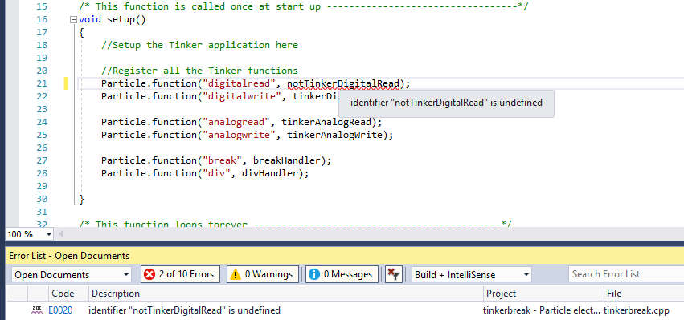

- Also things like too many arguments, for both your code and system firmware, as you type.

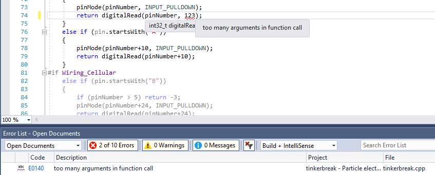

- Autocomplete, for both system firmware and your code. In this example, I typed `Serial.b` and it helpfully provided lots more info:

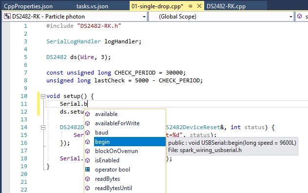

- Quick link to declaration (header file) and definition (source file). You can view all of the system firmware headers, but unfortunately not the implementations (since the whole system firmware is not indexed by IntelliSense).

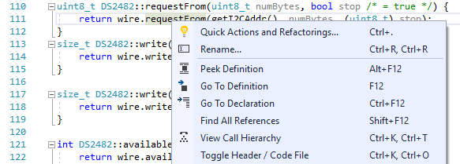

- Class View for easily navigating all your classes

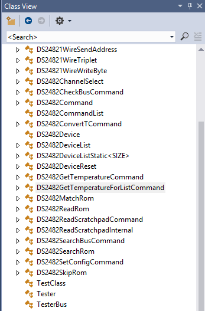

- Find all references. Click on source or the class view and find out where it's used. I selected it for DS2482GetTemperatureForListCommand and found it used in 3 examples and the regular source.

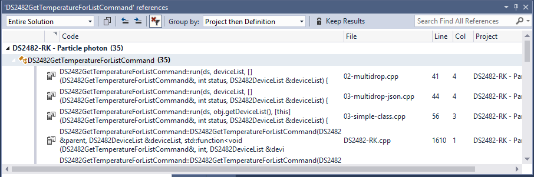

- Hover over constants, both in your own source and system firmware.

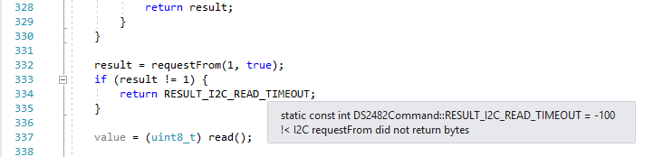

- For libraries with inline documentation, hovering over the class name brings up helpful information.

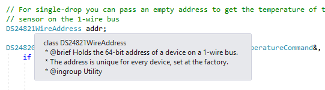

- Rename a class, method or function in a few clicks. It finds all of the places to fix in all files (including my example files) and also finds comments that probably need to be changed!

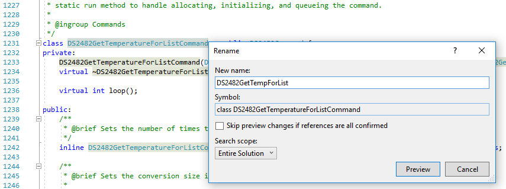

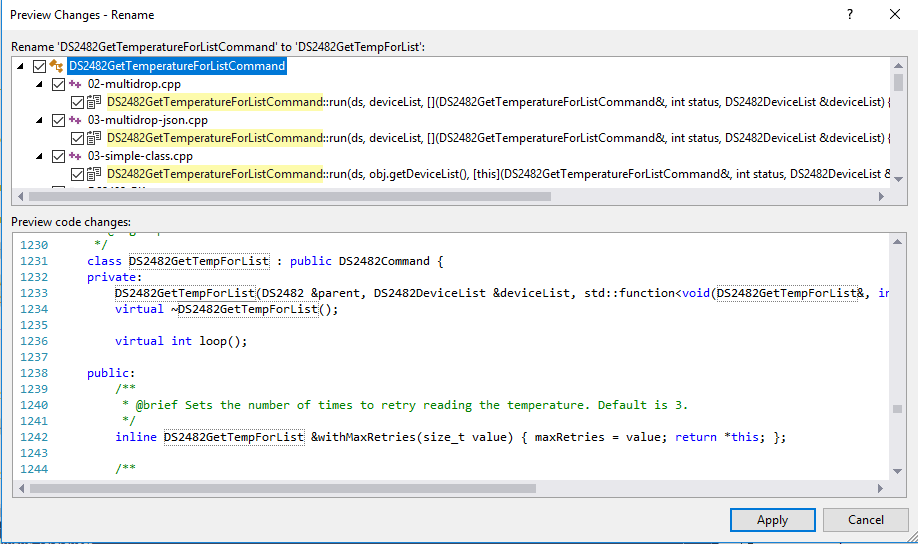

## Open Folders

This works using the Open Folders feature of Microsoft Visual Studio. There are no solution or workspace files necessary. You do need two files to make things useful however:

- CppProperties.json
- .vs/tasks.vs.json

The first one specifies all of the defines and includes necessary for IntelliSense to use build the source for analysis. You can download the file here. It's intended to be used with system firmware 0.7.0 but it will probably work with other versions. 

The second one specifies all of the things you can do, like compile, flash, etc.. I have made a few templates for common scenarios that you can customize for your particular use and project.

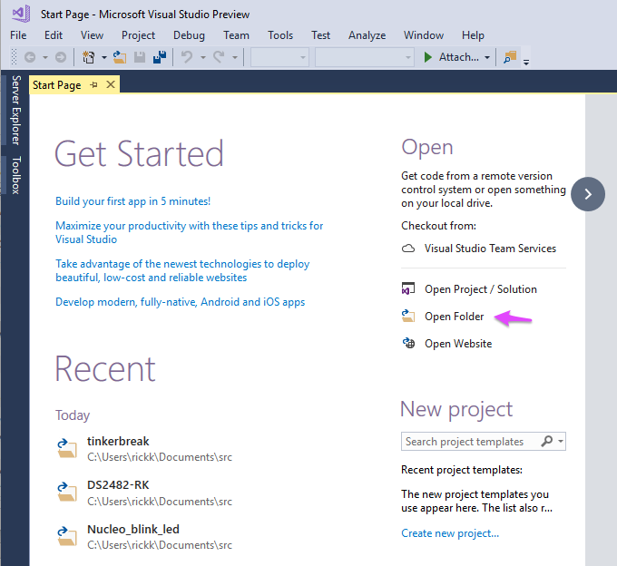

## CppProperties.json

The [CppProperties.json](https://github.com/rickkas7/visual-studio-for-particle/blob/master/CppProperties.json) file contains the various compiler settings so IntelliSense works properly. The files goes in the top level of your project folder.

- The projects settings menu in the toolbar will get two options: Particle Photon and Particle Electron. (1)

- This even sets the platform defines, so you'll notice that the code in block (2) is grayed out, because that code is only used for cellular devices (Electron), not the Photon.

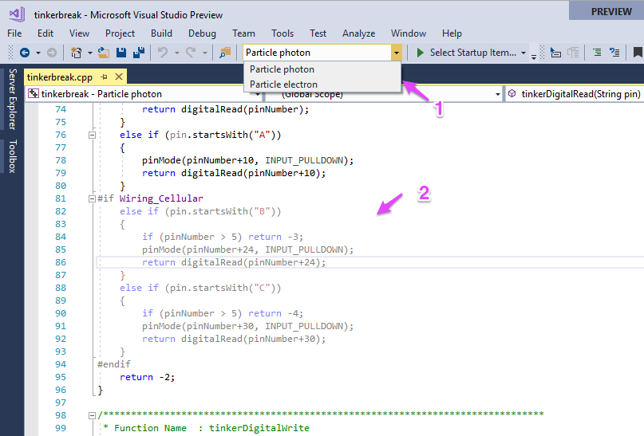

It doesn't include every platform. For example the P1 and Photon are nearly identical and this doesn't yet affect the actual build, so it only has Photon and Electron for now.

You generally don't need to edit this file, unless you want IntelliSense support for a library you include in your project (described below).

Also, because of what I believe is a bug that causes definitions in a conditional compilation to be missed, if you have an Electron project you should just delete the photon block off the top half to get more accurate IntelliSense results.

## tasks.vs.json

The tasks.vs.json file goes in the .vs directory. The easiest way to access it, however, is to right click on the folder name (1) and select **Configure Tasks** (2).

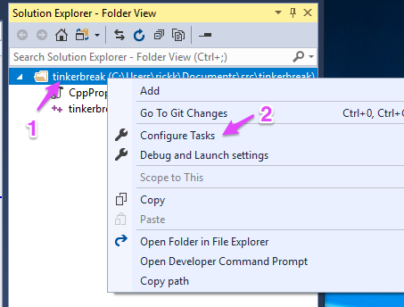

This file is JSON and is easily customized. I have two versions, one for Photon and one for Electron to start with, however you'll want to customize it.

### Photon Example

```
{
  "version": "0.2.1",
  "tasks": [
    {
      "taskName": "Build ${relativeFile} Photon",
      "appliesTo": "*.cpp",
      "type": "command",
      "command": "${env.COMSPEC}",
      "args": [
        "particle compile photon ${relativeFile} --saveTo firmware.bin"
      ]
    },
    {
      "taskName": "Build and Flash ${relativeFile} OTA test2",
      "appliesTo": "*.cpp",
      "type": "command",
      "command": "${env.COMSPEC}",
      "args": [
        "particle flash test2 ${relativeFile}"
      ]
    },
    {
      "taskName": "Build ${fileDirname} Photon",
      "appliesTo": "*.cpp",
      "type": "command",
      "command": "${env.COMSPEC}",
      "args": [
        "particle compile photon ${fileDirname} --saveTo firmware.bin"
      ]
    },
    {
      "taskName": "Build and Flash ${fileDirname} OTA test2",
      "appliesTo": "*.cpp",
      "type": "command",
      "command": "${env.COMSPEC}",
      "args": [
        "particle flash test2 ${fileDirname}"
      ]
    },
    {
      "taskName": "Build and Flash ${fileDirname} photon DFU",
      "appliesTo": "*.cpp",
      "type": "command",
      "command": "${env.COMSPEC}",
      "args": [
        "particle compile photon ${fileDirname} --saveTo firmware.bin && particle flash --usb firmware.bin"
      ]
    },
    {
      "taskName": "Flash DFU (--usb)",
      "appliesTo": "*.bin",
      "type": "command",
      "command": "${env.COMSPEC}",
      "args": [
        "particle flash --usb firmware.bin"
      ]
    }
  ]
}
```

With this tasks.vs.json file, you get a bunch of new options when you right click on a .cpp file in the Solution Explorer:

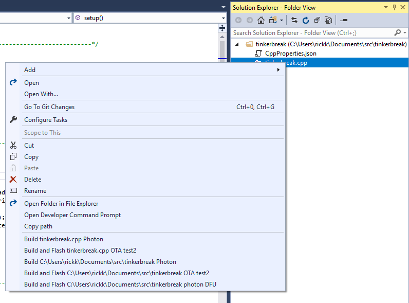

- **Build tinkerbreak.cpp Photon** builds only the the single tinkerbreak.cpp file into a firmware.bin binary for Photon. This is more useful in the library example, below.
- **Build and Flash tinkerbreak.cpp OTA test2** builds and flash to device test2. You can customize the device name in the tasks.vs.json file.
- **Build C:\\Users\\rickk\\Documents\\src\\tinkerbreak Photon** builds the whole directory containing tinkerbreak.cpp, as the Particle CLI and Particle Dev normally do.
- **Build and Flash C:\\Users\\rickk\\Documents\\src\\tinkerbreak OTA test2** builds the whole directory containing tinkerbreak.cpp and flashes it to device Test2.
- **Build and Flash C:\\Users\\rickk\\Documents\\src\\tinkerbreak photon DFU** builds the whole directory containing tinkerbreak.cpp and flashes it via DFU.

The output from the builds appears in the **Output** window, normally in the lower left.


### Electron Example

```
{
  "version": "0.2.1",
  "tasks": [
    {
      "taskName": "Build ${relativeFile} Electron",
      "appliesTo": "*.cpp",
      "type": "command",
      "command": "${env.COMSPEC}",
      "args": [
        "particle compile electron ${relativeFile} --saveTo firmware.bin"
      ]
    },
    {
      "taskName": "Build ${fileDirname} Electron",
      "appliesTo": "*.cpp",
      "type": "command",
      "command": "${env.COMSPEC}",
      "args": [
        "particle compile electron ${fileDirname} --saveTo firmware.bin"
      ]
    },
    {
      "taskName": "Build and Flash ${fileDirname} Electron DFU",
      "appliesTo": "*.cpp",
      "type": "command",
      "command": "${env.COMSPEC}",
      "args": [
        "particle compile electron ${fileDirname} --saveTo firmware.bin && particle flash --usb firmware.bin"
      ]
    },
    {
      "taskName": "Flash DFU (--usb)",
      "appliesTo": "*.bin",
      "type": "command",
      "command": "${env.COMSPEC}",
      "args": [
        "particle flash --usb firmware.bin"
      ]
    }
  ]
}
```

This tasks.vs.json file adds a few new options when you right click on a .cpp file:

- **Build tinkerbreak.cpp Electron** builds a firmware.bin file for only that file. This makes more sense for libraries, below.
- **Build C:\\Users\\rickk\\Documents\\src\\tinkerbreak Electron** builds a firmware.bin file for all of the files in the tinkerbreak directory, as would be the normal situation with the Particle CLI and Particle Dev.
- **Build and Flash C:\\Users\\rickk\\Documents\\src\\tinkerbreak Electron DFU** builds a firmware.bin file and then flashes in in DFU mode in on step.

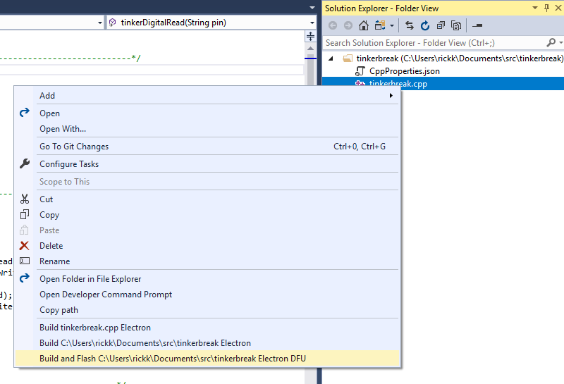

The build output appears in the Output panel normally in the lower left.

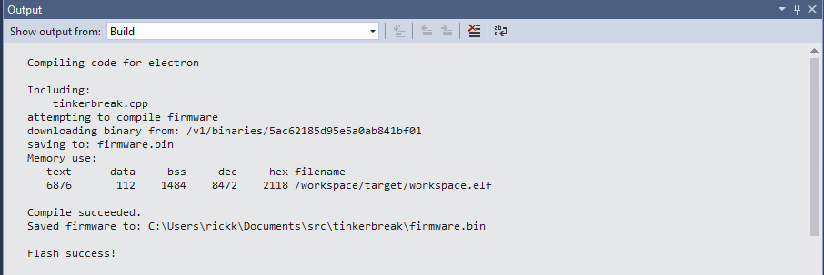

## Developing Libraries

When developing a Particle library, you typically have a layout that looks something like this:

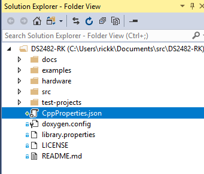

The Particle standard part is the library.properties, the src and examples directories, and the README.md file.

- To build a single example, expand the examples folder until you get to the .cpp file for that example (1) and right click.

- In this example, I selected **Build and Flash examples\01-single-drop\01-single-drop.cpp OTA test2**.

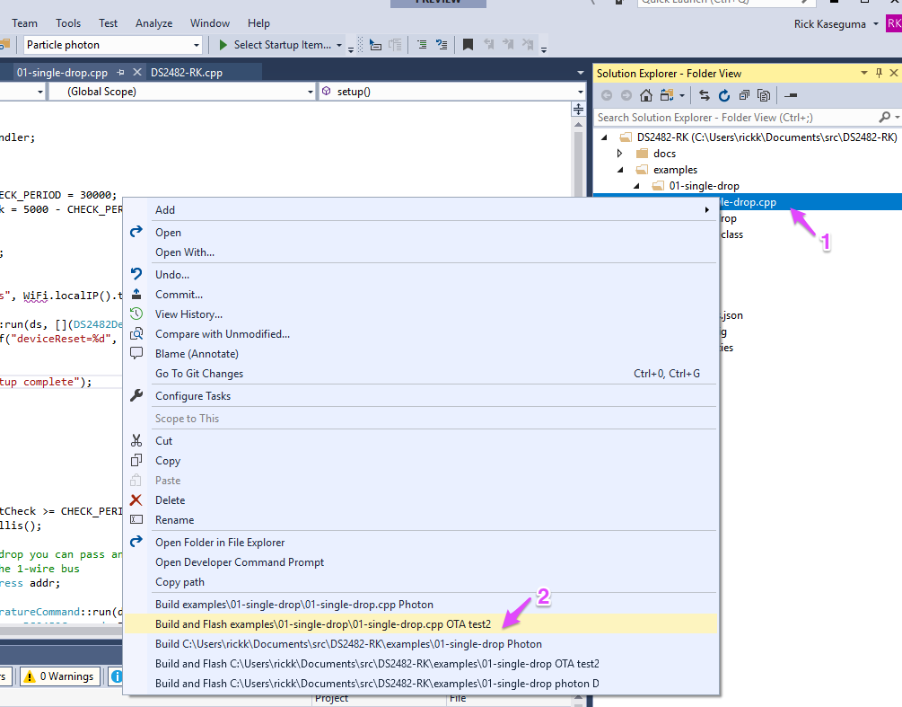

- The build output appears in the Output tab, usually the bottom left pane.

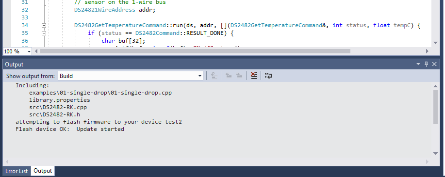

Note that because of the library.properties file it knew to pick up the actual library source files in the src directory automatically.

You can flip between various examples in seconds!

## Using Libraries

You can write code that uses libraries, as well. With a few minor tweaks to the CppProperies.json you can have full access to the the library headers with IntelliSense as well.

For example, in electron-clouddebug, it uses the CellularHelper library. My project.properties file looks like:

```
dependencies.CellularHelper=0.0.4
```

The first thing to do is make a local copy of the library files to they can be found by IntelliSense. These are created in the lib directory.

```
particle library copy CellularHelper
```

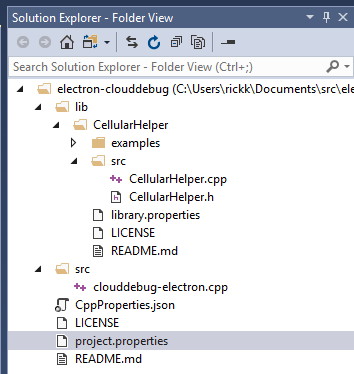

Then, in the CppProperties.json file, add the path to the src directory (or wherever the header files live) in each of the libraries you've included. For example:

```
        "${workspaceRoot}\\lib\\CellularHelper\\src",
```

Note there are two sections, one for Photon and one for Electron so make sure you edit both. Or if you are only building for Electron, just delete the Photon section.

Save the file, select **Project - Rescan Solution** and you should be able to see library IntellSense help!

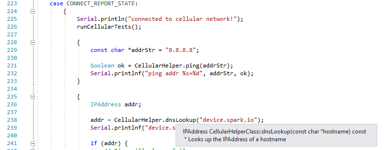


## Known Issues

- There are 8 errors that I wasn't able to easily resolve. Hey, there were like 2500 when I started, I can live with 8. I'll eventually try to figure out how to eliminate them, but for now you'll probably always see these. 

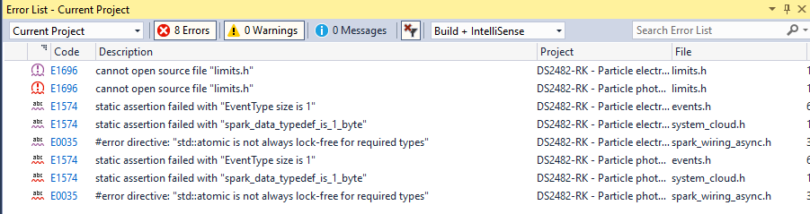

The easiest workaround is in the **Error List** select **Open Documents** instead of Current Project or solution. This will hide those errors.

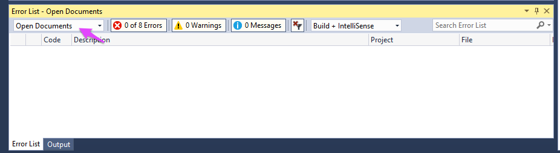

- Sometimes things are flagged as undefined even when IntelliSense works properly. This happens when the definition is conditional, a good example are the WiFi and Cellular classes. You can just ignore these.

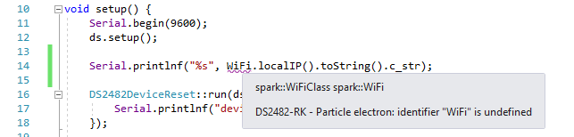

- These get added to the end of your tasks.vs.json all the time. I don't know why. You can delete them.

```
    {
      "taskName": "task-tinkerbreak",
      "appliesTo": "/",
      "type": "launch"
    }
```
